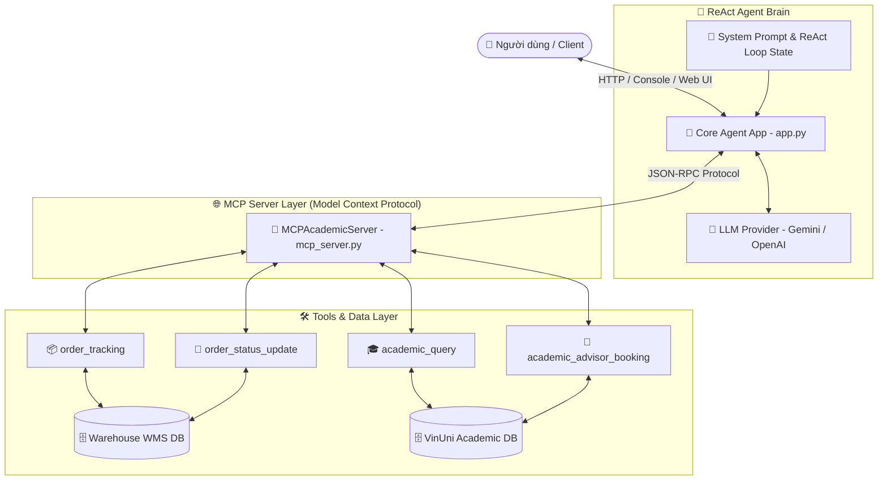
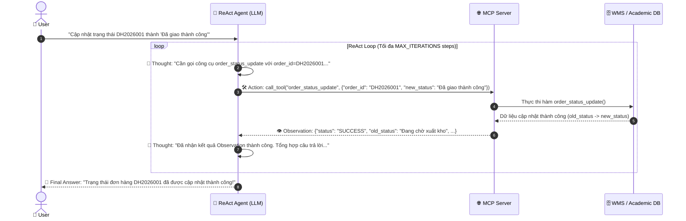

# 🚀 BÁO CÁO & TÀI LIỆU DEMO: REACT AGENT KẾT NỐI MCP SERVER
## Trợ Lý Thông Minh Chuỗi Cung Ứng & Kho Vận (Supply Chain & Academic Agent)

> **Môn học:** VINUNI AI COURSE - DAY 03 LAB: CHATBOT VS REACT AGENT  
> **Kiến trúc:** ReAct Pattern (Reasoning + Acting) + Model Context Protocol (MCP) + Gemini 1.5 Pro / 2.0 Flash / 3.1 Pro  

---

## 1. Đề Tài Lựa Chọn & Lý Do Chọn Đề Tài

### 🎯 Đề tài
**Trợ lý Thông minh Chuỗi Cung Ứng & Kho Vận (Supply Chain & Logistics Agent)** kết hợp **Trợ lý Học vụ Đại học VinUni**.

### 💡 Lý do lựa chọn
1. **Tính biến động & Đòi hỏi chính xác cao trong Kho Vận:**
   - Trong vận hành chuỗi cung ứng, thông tin về vị trí lưu kho, tình trạng xuất nhập kho và lịch sử vận chuyển của đơn hàng thay đổi liên tục theo thời gian thực.
   - LLM thông thường nếu không kết nối với cơ sở dữ liệu kho sẽ bị **Ảo giác (Hallucination)** — bịa ra vị trí đơn hàng hoặc trạng thái giao hàng, gây hậu quả nghiêm trọng cho doanh nghiệp.

2. **Yêu cầu tương tác 2 chiều (Đọc & Ghi):**
   - Người dùng không chỉ tra cứu thông tin (Read) mà còn yêu cầu thực hiện hành động nghiệp vụ (Write/Update) như cập nhật trạng thái vận đơn, chuyển kho, hoặc đặt lịch hẹn cố vấn.

3. **Chuẩn hóa kết nối qua Protocol MCP (Model Context Protocol):**
   - Việc phân tách rõ ràng giữa Agent (trí tuệ suy luận) và MCP Server (công cụ truy xuất dữ liệu) giúp hệ thống dễ dàng mở rộng sang các hệ thống ERP, WMS, CRM thực tế mà không cần viết lại core Agent.

---

## 2. Tại Sao ReAct Agent Pattern Lại Phù Hợp? (4 Tiêu Chí Agent Fit)

Mô hình **ReAct (Reasoning + Acting)** ghép nối khả năng **Suy luận (Thought)** và **Hành động (Action)** thành một vòng lặp phản hồi khép kín `Thought → Action → Observation → Thought → Final Answer`. Dưới đây là 4 tiêu chí chứng minh ReAct là kiến trúc tối ưu:

```
┌────────────────────────────────────────────────────────────────────────┐
│                        4 TIÊU CHÍ AGENT FIT                            │
├──────────────────┬──────────────────┬──────────────────┬───────────────┤
│ 1. Dynamic       │ 2. Multi-Step    │ 3. Tool          │ 4. Feedback   │
│    Decision      │    Reasoning     │    Integration   │    Loop       │
│  (Quyết định động│ (Suy luận nhiều  │ (Tích hợp công   │ (Vòng lặp quan│
│    theo ý định)  │     bước)        │   cụ chuẩn MCP)  │ sát Observation)
└──────────────────┴──────────────────┴──────────────────┴───────────────┘
```

### 1️⃣ Dynamic Decision Making (Quyết định luồng xử lý linh hoạt)
* **Vấn đề:** Yêu cầu người dùng rất đa dạng (chào hỏi xã giao, tra cứu mã đơn `DH2026001`, cập nhật trạng thái đơn, hay tra cứu mã không tồn tại `DH9999999`).
* **Tại sao cần ReAct:** Không thể hardcode bằng `if-else`. ReAct cho phép LLM đóng vai trò bộ não tự phân tích Intent để quyết định: Trả lời ngay (Final Answer) hay Gọi Tool phù hợp.

### 2️⃣ Multi-Step Reasoning (Suy luận chuỗi nhiều bước)
* **Vấn đề:** Các yêu cầu phức tạp như: *"Tra cứu đơn DH2026002, nếu đang ở Kho Tổng thì cập nhật trạng thái thành Đang điều phối xuất kho"*.
* **Tại sao cần ReAct:** Agent phải qua ít nhất 2 vòng lặp:
  - **Vòng 1:** Gọi `order_tracking` ➔ Nhận Observation là vị trí `"Kho Tổng - HN"`.
  - **Vòng 2:** LLM suy luận điều kiện (`"Kho Tổng - HN"` thỏa mãn `"Kho Tổng"`) ➔ Gọi tiếp `order_status_update`.
  - **Vòng 3:** Nhận kết quả cập nhật ➔ Tổng hợp Final Answer cho người dùng.

### 3️⃣ Tool Integration via MCP (Tích hợp công cụ chuẩn MCP)
* **Vấn đề:** LLM hoàn toàn không biết dữ liệu nội bộ kho hàng.
* **Tại sao cần ReAct:** Nhờ cơ chế Tool Calling theo chuẩn JSON-RPC của MCP Server, Agent gửi yêu cầu thực thi có cấu trúc (`tool_name`, `arguments`) và nhận về JSON Observation chính xác 100%, loại bỏ ảo giác.

### 4️⃣ Feedback Loop & Exception Handling (Vòng lặp quan sát & Xử lý ngoại lệ)
* **Vấn đề:** Mã đơn hàng nhập sai hoặc không tồn tại trong DB (`NOT_FOUND`).
* **Tại sao cần ReAct:** Khi MCP Server trả về Observation `{"status": "NOT_FOUND"}`, Agent nhận diện được kết quả này và ngay lập tức phản hồi lịch sự với người dùng thay vì báo lỗi crash hệ thống hay bịa dữ liệu.

---

## 3. Sơ Đồ Kiến Trúc Hệ Thống & Luồng Xử Lý (Workflow Diagram)

### 🏗️ Kiến trúc Hệ thống tổng quan (Component Architecture)



### 🔄 Luồng Vòng Lặp ReAct Loop (Sequence Workflow)



---

## 4. Danh Sách Công Cụ (MCP Tools) & Công Dụng

Hệ thống cung cấp **4 công cụ tiêu chuẩn** được đăng ký và thực thi qua MCP Server:

| STT | Tên Tool (`tool_name`) | Tham số đầu vào (Arguments) | Công dụng & Mô tả | Cơ sở dữ liệu tương tác |
|---|---|---|---|---|
| **1** | `order_tracking` | `order_id` (str) | Tra cứu vị trí lưu kho hiện tại, trạng thái đơn hàng, sản phẩm, số lượng và lịch sử vận chuyển. | 🗄️ WMS Database (`DH2026001`, `DH2026002`, `DH2026003`) |
| **2** | `order_status_update` | `order_id` (str), `new_status` (str) | Cập nhật trạng thái đơn hàng mới vào cơ sở dữ liệu quản lý kho vận. | 🗄️ WMS Database |
| **3** | `academic_query` | `student_id` (str) | Tra cứu điểm GPA, lớp học, email và Cố vấn học tập của sinh viên VinUni. | 🗄️ VinUni Academic DB (`SV2026001`, `SV2026002`) |
| **4** | `academic_advisor_booking` | `student_id` (str), `date` (str), `time` (str) | Đặt lịch hẹn gặp Cố vấn học tập cho sinh viên. | 🗄️ VinUni Academic DB |

---

## 5. Minh Họa Chạy Demo & Trace Log Chi Tiết Từng Bước

Dưới đây là vết thực thi thực tế (**Waterfall Trace Log**) ghi nhận từ vòng lặp ReAct của Agent khi chạy với Gemini API thật:

### 🧪 Kịch bản Test 1: [TC03] Cập nhật trạng thái đơn hàng (Medium)
* **Câu hỏi:** *"Cập nhật trạng thái của mã vận đơn DH2026001 thành 'Đã giao thành công'."*

```json
[
  {
    "step": 1,
    "query": "Cập nhật trạng thái của mã vận đơn DH2026001 thành 'Đã giao thành công'.",
    "action_type": "TOOL_EXECUTION",
    "tool_name": "order_status_update",
    "arguments": {
      "new_status": "Đã giao thành công",
      "order_id": "DH2026001"
    },
    "observation": {
      "status": "SUCCESS",
      "order_id": "DH2026001",
      "old_status": "Đang chờ xuất kho",
      "new_status": "Đã giao thành công",
      "message": "Cập nhật trạng thái đơn hàng DH2026001 thành công: 'Đang chờ xuất kho' → 'Đã giao thành công'."
    },
    "latency_ms": 974.6
  },
  {
    "step": 2,
    "query": "Cập nhật trạng thái của mã vận đơn DH2026001 thành 'Đã giao thành công'.",
    "action_type": "FINAL_ANSWER",
    "thought": "Gemini phản hồi trực tiếp bằng văn bản (không cần gọi công cụ).",
    "output": "**Thought:** Người dùng muốn cập nhật trạng thái đơn hàng và kết quả thực hiện từ công cụ `order_status_update` đã được trả về trong Observation. Tôi sẽ tổng hợp lại thông tin đó để thông báo cho người dùng một cách rõ ràng và chính xác.\n\n**Trả lời:**\nTrạng thái của đơn hàng **DH2026001** đã được cập nhật thành công!\n- **Trạng thái cũ:** Đang chờ xuất kho\n- **Trạng thái mới:** Đã giao thành công",
    "latency_ms": 1927.18
  }
]
```

### 🧪 Kịch bản Test 2: [TC05] Xử lý mã vận đơn không tồn tại (Edge Case)
* **Câu hỏi:** *"Kiểm tra mã vận đơn DH9999999 xem đang ở kho nào."*

```json
[
  {
    "step": 1,
    "query": "Kiểm tra mã vận đơn DH9999999 xem đang ở kho nào.",
    "action_type": "TOOL_EXECUTION",
    "tool_name": "order_tracking",
    "arguments": {
      "order_id": "DH9999999"
    },
    "observation": {
      "status": "NOT_FOUND",
      "message": "Không tìm thấy đơn hàng có mã vận đơn 'DH9999999'"
    },
    "latency_ms": 891.89
  },
  {
    "step": 2,
    "query": "Kiểm tra mã vận đơn DH9999999 xem đang ở kho nào.",
    "action_type": "FINAL_ANSWER",
    "thought": "Gemini phản hồi trực tiếp bằng văn bản (không cần gọi công cụ).",
    "output": "Dựa vào kết quả Observation từ công cụ `order_tracking`, mã vận đơn `DH9999999` không tồn tại trong hệ thống kho vận.\n\nTôi xin thông báo: Không tìm thấy đơn hàng có mã vận đơn **DH9999999** trong hệ thống. Vui lòng kiểm tra lại mã vận đơn của bạn!",
    "latency_ms": 1034.96
  }
]
```

---

## 🖥️ HƯỚNG DẪN KHỞI CHẠY INTERACTIVE WEB UI DEMO

Để buổi thuyết trình và demo trở nên trực quan và chuyên nghiệp nhất, thư mục `demo/` đã được tích hợp sẵn một **Web Dashboard UI** cao cấp (Glassmorphic Design) cho phép tương tác trực tiếp:

### 🚀 Khởi chạy Web Demo UI:
Chạy lệnh sau trên Terminal:
```bash
python demo/server.py
```
Sau đó mở trình duyệt tại địa chỉ: **`http://localhost:8000`**

### ✨ Các tính năng nổi bật trên Web UI:
1. **Interactive Demo Chat:** Nhập câu hỏi bất kỳ hoặc chọn nhanh 5 Test Cases có sẵn để xem Agent suy luận thời gian thực.
2. **Real-time Trace Waterfall:** Visual hóa timeline từng bước `Step 1 Thought ➔ Action ➔ Observation ➔ Step 2 Final Answer` với latency (ms).
3. **Architecture & 4 Agent Fit Matrix:** Hiển thị trực quan sơ đồ luồng Mermaid và bảng 4 tiêu chí Agent Fit ngay trên giao diện web.
4. **Tool Inspector:** Tra cứu nhanh danh sách tool và schema tham số.
